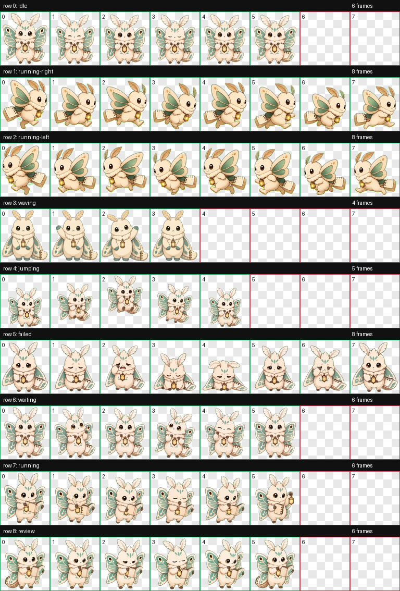

# Memo Codex Pet

Memo is the companion Codex Pet for Mnemosyne: a calm memory-keeper mascot for thoughtful life and work threads.

## Install

Copy the packaged pet files into your Codex pets directory:

```bash
mkdir -p "${CODEX_HOME:-$HOME/.codex}/pets/memo"
cp codex-pet/memo/pet.json codex-pet/memo/spritesheet.webp "${CODEX_HOME:-$HOME/.codex}/pets/memo/"
```

Then select `Memo` from the Codex pet picker.

## Files

- `pet.json`: Codex pet manifest.
- `spritesheet.webp`: final 1536x1872 transparent atlas, 192x208 cells.
- `LICENSE`: Creative Commons Attribution 4.0 International license for Memo artwork and media.
- `qa/contact-sheet.png`: visual contact sheet for all 9 animation rows.
- `qa/previews/*.gif`: per-state motion previews.
- `qa/validation-summary.json`: path-free atlas validation summary.
- `qa/review-summary.json`: path-free frame review summary.

## Animation Rows

Memo follows the Codex 9-row pet contract:

1. `idle`
2. `running-right`
3. `running-left`
4. `waving`
5. `jumping`
6. `failed`
7. `waiting`
8. `running`
9. `review`

The atlas validates with no errors or warnings. Frame review passes with `stable-slots` extraction warnings, which means the preserved slot geometry should be visually checked through the included GIF previews.

## Preview



## License

Memo artwork and media files are licensed under Creative Commons Attribution 4.0 International. The surrounding Mnemosyne project code is licensed separately under Apache License 2.0.
